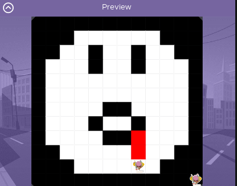
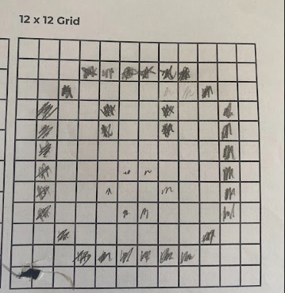

# Unit 1 - Asphalt Art

## Introduction

Cities use asphalt art to improve public safety, inspire their residents and visitors, and brighten communities. Your goal is to create asphalt art to revitalize The Neighborhood and bring the community together with the help of the Painter.

## Requirements

Use your knowledge of object-oriented programming, algorithms, the problem solving process, and decomposition strategies to create asphalt art:
- **Create a new subclass** – Create at least one new subclass of the PainterPlus class that is used for a component of the asphalt art design.
- **Plan an algorithm** – Use the problem solving process and decomposition strategies to plan an algorithm that incorporates a combination of sequencing, selection, and/or iteration.
- **Write a method** – Write at least one method in a PainterPlus subclass that contributes to a component of the asphalt art design.
- **Document your code** – Use comments to explain the purpose of the methods and code segments.

## Notes: Neighborhood & Painter Class

This project was created on Code.org's JavaLab platform using the built in Neightborhood GUI output. To test and edit this project you must build in Code.org's JavaLab with the Neighborhood GUI enabled. For reference to the Painter class documentation, [you can read more here.](https://studio.code.org/docs/ide/javalab/classes/Painter)

## Output:

                

## Reflection

1. Describe your project.

   - My Project is a simple vampire that has blood coming down his mouth. It was completed on a 12x12 format. I made a vampire because October is coming up and I didn't know which to choose between a ghost or a vampire.

2. What are two things about your project that you are proud of?

   - Firstly, I'm proud of the coding I did for the face creation, I thought it was going to be difficult, but I was able to do it. Secondly, I'm proud of being able to code the actual eyes and mouth, I'm proud of that because I was able to do it efficiently using minimal code. 

3. Describe something you would improve or do differently if you had an opportunity to change something about your project.

   - Something I would do to improve/do differently if I had an opportunity to change something on my project is using the 32x32 format and add more to my emoji. Such as a hat and just stuff in general that vampires in movies carry.